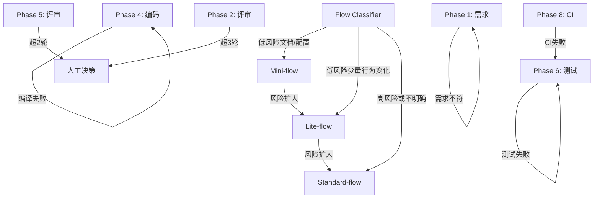

# 开发流程规范

本流程基于 Harness Engineering 十阶段工作流，融合 Define→Plan→Build→Verify→Review→Ship 生命周期。新需求不再默认套用完整十阶段，而是先执行 Flow Classifier；高风险或不明确需求进入 Standard-flow，明确低风险任务自动选择 Mini-flow 或 Lite-flow。

## 核心原则

1. **风险分级优先于固定流程** — 先执行 Flow Classifier，再选择 Mini-flow / Lite-flow / Standard-flow。
2. **分离实现、审查、测试证据** — 实现、审查、测试由不同 Skill 流程和证据产物承载。
3. **进度持久化** — 状态写入文件系统，而非上下文窗口。
4. **刚好够用的上下文** — 上下文填充率控制在 40% 以内。
5. **唯一 Orchestrator + 本地 Skills** — 不新增独立 Agent 文件。

## Harness Iron Laws

1. 未验证，不得声称完成、通过或交付。
2. 未读相关代码、规则或证据，不得提出修改方案或放行结论。
3. Mechanical Gate 失败或阻塞时，不得请求用户人工放行。
4. 任意失败必须 Stop-the-Line 定位根因，不得只修表象或跳过验证。
5. 业务规则未知时必须查 `.harness/wiki/` 或记录疑问，不得猜测。
6. 子代理/隔离上下文只能执行受限任务，不得替代 Orchestrator 决策。
7. 流程分级只能降低阶段密度，不能取消 Mechanical Gate、fresh verification evidence、Memory check、Stop-the-Line 或必要 Human Approval Gate。

## Flow Classifier

收到新需求后，Orchestrator 必须先执行 Flow Classifier，并把结果写入 `.harness/changes/{id}/summary.md` 的 `## Flow Classification` 小节。

分类字段：

| 字段 | 含义 |
|------|------|
| `flow` | `Mini-flow` / `Lite-flow` / `Standard-flow` |
| `selection_basis` | 为什么选择该流程，必须引用任务影响面和风险判断 |
| `risk_flags` | 命中的风险标记，如 `security`、`data`、`api`、`auth`、`payment`、`perf`、`migration`、`architecture`、`unclear-requirement` |
| `confirmation_policy` | `exception-only` / `batched` / `mandatory` |
| `upgrade_triggers` | 触发 Stop-the-Line 并升级流程的条件 |

### 自动选择规则

| Flow | 自动适用场景 | 强制升级条件 | confirmation_policy |
|------|--------------|--------------|---------------------|
| Mini-flow | typo、注释、格式、纯文档、README 小修、无行为变化小配置 | 任何代码行为变化、需求不清、涉及安全/数据/接口/部署 | `exception-only` |
| Lite-flow | 单模块/少量文件、明确低风险行为变化、简单 bugfix、简单测试补充 | 跨模块、API/DB/schema/auth/payment/security/perf/migration/architecture | `batched` |
| Standard-flow | 新功能、跨模块、架构/数据/安全/权限/外部接口/迁移/性能/部署、需求不清 | N/A | `mandatory` |

### 强制升级条件

任一条件出现时，必须 Stop-the-Line，记录升级原因，更新 `summary.md`，并升级到更高流程：

- Mini-flow 发现代码行为变化、业务规则不明确、需要用户业务判断，或需要独立评审。
- Lite-flow 发现跨模块影响、接口/数据库/schema/auth/payment/security/perf/migration/architecture 变更。
- 任一流程的 Mechanical Gate 为 `fail|blocked` 且无法在当前流程步骤内修复。
- 验证证据不足以支撑当前完成声明。
- Memory 记录要求被触发但无法按完整模板记录。

## 流程分级

| 流程 | 自动适用场景 | 阶段形态 | 确认策略 | 必需产物 | 门禁要求 | 禁止事项 |
|------|--------------|----------|----------|----------|----------|----------|
| Mini-flow | typo、注释、格式、纯文档、README 小修、无行为变化小配置 | 理解/分类 → 修改 → 验证 → 记录/总结 | exception-only：分类不确定、门禁失败/阻塞、需要业务判断或最终摘要时确认 | summary.md、变更说明、验证证据、Memory check | Mechanical Gate、fresh verification evidence、Memory check、必要 Human Approval Gate | 不得用于任何代码行为变化；不得声明 Standard-flow 完成 |
| Lite-flow | 单模块/少量文件、明确低风险行为变化、简单 bugfix、简单测试补充 | 需求确认+简化计划 → 实现 → 验证/压缩评审 → 交付 | batched：需求+简化计划确认一次，最终验证/评审摘要确认一次；中间门禁通过则继续 | summary.md、lite_spec.md、checklist.md、verification_report.md、review_summary.md、Memory check | Mechanical Gate、压缩版 Two-stage Review、fresh verification evidence、Memory check、必要 Human Approval Gate | 不得用于高风险/跨模块/API/DB/schema/auth/payment/security/perf/migration/architecture 变更 |
| Standard-flow | 新功能、跨模块、架构/数据/安全/权限/外部接口/迁移/性能/部署、需求不清 | 完整 Phase 1-10 | mandatory：保持 CK1-CK9 阶段确认 | 全部阶段产物和门禁 | 完整 Mechanical Gate + Human Approval Gate 链路 | 不得跳 Phase |

Mini-flow 可豁免独立评审，但必须记录豁免依据和验证证据。Lite-flow 使用压缩版 Two-stage Review：实现后自检 + 独立/隔离评审摘要。任何 confirmation policy 都不能绕过失败或阻塞的 Mechanical Gate。

## Confirmation Policy

| Policy | 默认 Flow | 行为 |
|--------|-----------|------|
| `mandatory` | Standard-flow | 保持 CK1-CK9 阶段确认；用户确认前不得进入下一 Phase。 |
| `batched` | Lite-flow | 需求+简化计划确认一次，最终验证/评审摘要确认一次；中间 Mechanical Gate 通过则可继续。 |
| `exception-only` | Mini-flow | 仅分类不确定、门禁失败/阻塞、需要业务判断或最终摘要时确认。 |

Human Approval Gate 的时机可以按风险分级，但不能绕过 Mechanical Gate、fresh evidence、Memory check 或 Stop-the-Line。

## 隔离执行上下文原则

隔离执行上下文是 Orchestrator 调度下的受限任务或审查泳道，不是新增 Agent 文件。

- 输入隔离：每个泳道收到同一份不可变输入包。
- 输出隔离：每个泳道只写自己的报告。
- 结论隔离：初次报告产出前不参考其他泳道结论。
- 权限隔离：隔离上下文不能推进 Phase、不能请求用户确认、不能修改无关文件。
- 汇总集中：只有 Orchestrator 能合并报告、判断 Mechanical Gate、请求 Human Approval Gate。

## Standard-flow 十阶段工作流

Standard-flow 适用于高风险或不明确需求，保持完整 Phase 1-10、CK1-CK9 和逐 Phase Mechanical Gate。

### Phase 1: 需求分析
- **入口**: 收到需求并经 Flow Classifier 判定为 Standard-flow
- **Skill 加载**: `idea-refine`
- **动作**: 阅读上下文 → 复述需求 → 明确边界 → 输出需求理解文档
- **产出**: `.harness/changes/{id}/request_analysis/understanding.md`
- **Mechanical Gate**: `understanding.md` 存在且包含复述、边界、疑问点、Memory check
- **Human Approval Gate**: CK1 用户确认需求理解
- **注意**: 此阶段不产 spec.md，只做需求澄清

### Phase 2: 需求评审
- **入口**: Phase 1 门禁通过且 CK1 approved
- **Skill 加载**: `spec-driven-development`
- **动作**: 基于 understanding.md 编写正式 PRD
- **产出**: `.harness/changes/{id}/request_analysis/spec.md`
- **注意**: 此阶段只产 spec.md，不产 tasks.md。tasks.md 是 Phase 3 的职责
- **评审上限**: 最多 3 轮，超出升级人工
- **Mechanical Gate**: spec.md 存在且 tasks.md 不由 Phase 2 创建，Memory check
- **Human Approval Gate**: CK2 用户确认 spec

### Phase 3: 任务规划
- **入口**: Phase 2 门禁通过且 CK2 approved
- **Skill 加载**: `planning-and-task-breakdown`
- **动作**: 分解为可验证任务 → 标注依赖 → 确定优先级
- **产出**: `.harness/changes/{id}/request_analysis/tasks.md`（首次创建）
- **Mechanical Gate**: tasks.md 存在且每个任务有明确验收条件、可独立验证，Memory check
- **Human Approval Gate**: CK3 用户确认任务规划

### Phase 4: 编码实现
- **入口**: Phase 3 门禁通过且 CK3 approved
- **Skill 加载**: `incremental-implementation`
- **动作**: Orchestrator 调度本地 Skill 按垂直切片增量实现 → 每片编译验证 → 每片报告进度 → 实现后自检
- **Two-stage Review**: Stage 1: Author/Self Review，由 `auto-check-and-optimize` 在编译后执行
- **验证**: 仅 `mvn clean compile`，不运行测试
- **产出**: `.harness/changes/{id}/coding/coding_report_v1.md`
- **Mechanical Gate**: 编译成功且 coding_report_v1.md 存在，self review completed，fresh verification evidence 已列出，Memory check
- **Human Approval Gate**: CK4 用户确认可提交评审
- **隔离上下文**: `auto-check-and-optimize` 自检作为隔离泳道执行，遵守"隔离执行上下文原则"（见本文件第 75–83 行）

### Phase 5: 编码评审
- **入口**: Phase 4 门禁通过且 CK4 approved
- **Skill 加载**: Orchestrator 并行调度 `code-review-and-quality` + `security-and-hardening` + `performance-optimization`
- **Two-stage Review**: Stage 2: Independent Review，不替代 Phase 4 的 Author/Self Review
- **动作**: 并行执行 3 个本地 Skill 隔离审查泳道；每个泳道使用同一份不可变输入包，独立写自己的报告，全部完成后汇总
- **产出**: `.harness/changes/{id}/coding/review/*.md`
- **评审上限**: 最多 2 轮，超出升级人工
- **Mechanical Gate**: 三份评审报告存在，independent review lanes isolated，review summary exists，Critical=0，Must Fix=0，fresh verification evidence 已列出，Memory check
- **Human Approval Gate**: CK5 用户确认评审摘要

### Phase 6: 单元测试
- **入口**: Phase 5 门禁通过且 CK5 approved
- **Skill 加载**: `test-driven-development`
- **动作**: 检查 JaCoCo → 编写单元测试 → 集成测试 → 覆盖率检查
- **产出**: `test_report.md`（含测试总数、通过数、行覆盖率、分支覆盖率）
- **Mechanical Gate**: 测试通过、测试数大于 0、覆盖率达标，Memory check
- **Human Approval Gate**: CK6 用户确认测试结果
- **隔离上下文**: 测试执行作为隔离泳道执行，遵守"隔离执行上下文原则"（见本文件第 75–83 行）

### Phase 7: 测试评审
- **入口**: Phase 6 门禁通过且 CK6 approved
- **Skill 加载**: `code-review-and-quality` 的测试审查标准，按需参考 `test-driven-development`
- **产出**: `.harness/changes/{id}/unit_test/review/test_review_v1.md`
- **Mechanical Gate**: 测试评审报告存在，Must Fix=0，Memory check
- **Human Approval Gate**: CK7 用户确认测试评审

### Phase 8: CI 验证
- **入口**: Phase 7 门禁通过且 CK7 approved
- **Skill 加载**: `ci-cd-and-automation`
- **动作**: 运行 `mvn verify` → 检查结果
- **产出**: `.harness/changes/{id}/ci_result/ci_report.md`
- **Mechanical Gate**: CI 报告存在且成功，Memory check
- **Human Approval Gate**: 按 Standard-flow 规则确认或按已记录规则放行

### Phase 9: 部署验证
- **入口**: Phase 8 门禁通过
- **Skill 加载**: `shipping-and-launch`
- **动作**: 运行 `mvn clean package -DskipTests` → 冒烟测试 → 回滚就绪
- **产出**: `.harness/changes/{id}/deployment/deploy_report.md`
- **Mechanical Gate**: 部署报告存在，冒烟/回滚检查完成，Memory check
- **Human Approval Gate**: CK8 用户确认部署参数和结果

### Phase 10: 用户确认
- **入口**: Phase 9 门禁通过且 CK8 approved
- **动作**: 生成 delivery-summary.md → 更新 summary.md → 列出所有归档文件 → 检查 memory 是否需要沉淀
- **Mechanical Gate**: delivery-summary、summary 状态、memory 检查完成
- **Human Approval Gate**: CK9 用户最终确认

## Mini-flow 执行顺序

1. 理解/分类：执行 Flow Classifier，确认 `flow=Mini-flow`、`confirmation_policy=exception-only`，写入 summary.md。
2. 修改：仅进行无行为变化的小改动。
3. 验证：执行适配任务的最小验证；纯文档可用内容审查和一致性搜索作为 fresh evidence。
4. 记录/总结：更新 summary.md、Memory check、最终摘要；分类不确定、门禁失败/阻塞、需要业务判断或最终摘要时触发 Human Approval Gate。

## Lite-flow 执行顺序

1. 需求确认+简化计划：执行 Flow Classifier，写入 summary.md、`request_analysis/lite_spec.md`、`request_analysis/checklist.md`，进行一次 batched Human Approval Gate。
2. 实现：按 checklist 修改，若风险扩大则 Stop-the-Line 并升级。
3. 验证/压缩评审：生成 `verification_report.md` 和 `review_summary.md`，包含 fresh verification evidence、压缩版 Two-stage Review、Memory check。
4. 交付：最终验证/评审摘要确认一次；Mechanical Gate fail/blocked 时不得请求人工放行。

## Phase / Flow 出口顺序

### Standard-flow

每个 Phase 必须按以下顺序退出：

1. 检查并记录 Memory：是否有架构决策/错误教训/技术限制？如有，按对应文件模板完整写入。
2. 执行 Mechanical Gate。
3. verification-before-completion：出口报告必须列出 Mechanical Gate 状态、新鲜验证证据（命令、结果、报告路径或审查报告路径）、`Memory recorded: {N} entries / none`。
4. Mechanical Gate 状态为 `fail` 或 `blocked` 时执行 Failure Handling Protocol，不得请求用户人工放行。
5. Mechanical Gate 状态为 `pass` 后，将 Human Approval Gate 标记为 `pending-human`。
6. 用户确认后才能进入下一 Phase。

### Lite-flow

按 batched confirmation policy 执行：需求+简化计划出口确认一次；实现、验证/压缩评审的 Mechanical Gate 通过且证据完整时可继续；最终验证/评审摘要再确认一次。

### Mini-flow

按 exception-only confirmation policy 执行：分类不确定、门禁失败/阻塞、需要业务判断或最终摘要时确认；Mechanical Gate fail/blocked 不得请求人工放行。

## 人类确认点

CK1-CK9 仅适用于 Standard-flow mandatory confirmation policy。

| 确认点 | Standard-flow 时机 | 确认内容 |
|--------|-------------------|----------|
| CK1 | Phase 1 后 | 需求理解确认 |
| CK2 | Phase 2 后 | Spec 评审确认 |
| CK3 | Phase 3 后 | 任务规划确认 |
| CK4 | Phase 4 后 | 编码完成确认 |
| CK5 | Phase 5 后 | 编码评审确认 |
| CK6 | Phase 6 后 | 测试结果确认 |
| CK7 | Phase 7 后 | 测试评审确认 |
| CK8 | Phase 9 前 | 部署参数确认 |
| CK9 | Phase 10 | 最终交付确认 |

Lite-flow 使用 batched 确认；Mini-flow 使用 exception-only 确认。任何确认策略都不能绕过 Mechanical Gate fail/blocked。

## 产物归档结构

Standard-flow 使用完整十阶段目录；Mini-flow/Lite-flow 仅保留对应流程需要的进度表和产物，不把未采用流程标记为“跳过”。

### Standard-flow

```text
.harness/changes/{type}-{name}-{YYYYMMDD}/
├── summary.md
├── request_analysis/
│   ├── understanding.md
│   ├── spec.md
│   ├── tasks.md
│   └── review/
├── coding/
│   ├── coding_report_v1.md
│   └── review/
├── unit_test/
│   ├── test_report.md
│   └── review/
├── ci_result/
└── deployment/
```

### Mini-flow

```text
.harness/changes/{type}-{name}-{YYYYMMDD}/
├── summary.md
├── verification_report.md
└── review_summary.md
```

### Lite-flow

```text
.harness/changes/{type}-{name}-{YYYYMMDD}/
├── summary.md
├── request_analysis/
│   ├── lite_spec.md
│   └── checklist.md
├── verification_report.md
└── review_summary.md
```

## Failure Handling Protocol

任一 Mechanical Gate 状态为 `fail|blocked` 时，必须 Stop-the-Line：

1. 停止进入下一阶段或分级流程步骤，不请求 Human Approval Gate 放行。
2. 记录失败证据：失败命令、日志、报告路径、缺失条件或阻塞原因。
3. 复现或确认失败条件。
4. 定位根因，区分需求问题、实现问题、测试问题、环境问题或流程问题。
5. 回退到规则定义的 Phase 或当前分级流程对应步骤。
6. 修复并重新验证，生成新的 fresh verification evidence。
7. 如属于 Agent 错误或可复用教训，完整写入 `lessons-learned.md`（问题、根因、影响、修复、预防）。
8. 如风险扩大，更新 Flow Classification 并升级流程。

## 回退路径


