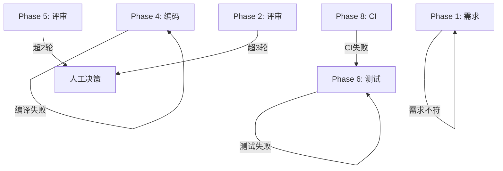

# 开发流程规范

本流程基于 Harness Engineering 十阶段工作流，融合 agent-skills 的 Define→Plan→Build→Verify→Review→Ship 生命周期。

## 核心原则

1. **流程一致性优先于流程效率** — 小需求也走完整流程
2. **分离执行与评判** — 编码 Agent 和评审 Agent 用不同模型
3. **进度持久化** — 状态写入文件系统，而非上下文窗口
4. **刚好够用的上下文** — 上下文填充率控制在 40% 以内

## 十阶段工作流

### Phase 1: 需求分析
- **入口**: 收到需求
- **Skill 加载**: `idea-refine`
- **动作**: 阅读上下文 → 复述需求 → 明确边界 → 输出需求理解文档
- **产出**: `.harness/changes/{id}/request_analysis/understanding.md`
- **质量门禁**: 需求复述通过、边界明确、疑问点已识别
- **注意**: 此阶段不产 spec.md，只做需求澄清

### Phase 2: 需求评审
- **入口**: Phase 1 门禁通过
- **Skill 加载**: `spec-driven-development`
- **动作**: 基于 understanding.md 编写正式 PRD
- **产出**: `.harness/changes/{id}/request_analysis/spec.md`
- **注意**: 此阶段只产 spec.md，不产 tasks.md。tasks.md 是 Phase 3 的职责
- **评审上限**: 最多 3 轮，超出升级人工
- **质量门禁**: spec.md 通过评审

### Phase 3: 任务规划
- **入口**: Phase 2 门禁通过
- **Skill 加载**: `planning-and-task-breakdown`
- **动作**: 分解为可验证任务 → 标注依赖 → 确定优先级
- **产出**: `.harness/changes/{id}/request_analysis/tasks.md`（首次创建）
- **质量门禁**: 每个任务有明确验收条件、可独立验证

### Phase 4: 编码实现
- **入口**: Phase 3 门禁通过
- **Skill 加载**: `incremental-implementation`
- **动作**: 按垂直切片增量实现 → 每片编译验证 → 每片报告进度
- **验证**: 仅 `mvn clean compile`，不运行测试
- **质量门禁**: 编译通过、增量可回退
- **规则**: Orchestrator 不写代码，分派给执行子 Agent
- **进度**: 每完成一个子任务报告 "Task i/N 已完成"

### Phase 5: 编码评审
- **入口**: Phase 4 门禁通过
- **Skill 加载**: `code-review-and-quality` + `security-and-hardening` + `performance-optimization`
- **Agent 加载**: 并行加载 `.harness/agents/code-reviewer.md`、`.harness/agents/security-auditor.md`、`.harness/agents/test-engineer.md`
- **动作**: 并行扇出 3 个审查 Agent，逐一报告完成进度
- **评审上限**: 最多 2 轮，超出升级人工
- **质量门禁**: 所有 Critical/Must Fix 问题已解决
- **通信**: 汇总后一次展示结论，只问一次用户确认

### Phase 6: 单元测试
- **入口**: Phase 5 门禁通过
- **Skill 加载**: `test-driven-development`
- **动作**: 检查 JaCoCo → 编写单元测试 → 集成测试 → 覆盖率检查
- **产出**: `test_report.md`（含测试总数、通过数、行覆盖率、分支覆盖率）
- **质量门禁**: 覆盖率 >= 80%、全部通过
- **注意**: 此阶段是唯一正式测试阶段。Phase 4 不做测试

### Phase 7: 测试评审
- **入口**: Phase 6 门禁通过
- **Skill 加载**: 加载 `.harness/agents/test-engineer.md` 执行审查
- **评审上限**: 最多 2 轮
- **质量门禁**: 测试质量评审通过

### Phase 8: CI 验证
- **入口**: Phase 7 门禁通过
- **Skill 加载**: `ci-cd-and-automation`
- **动作**: 运行 `mvn verify` → 检查结果
- **质量门禁**: CI 全绿、性能不退化

### Phase 9: 部署验证
- **入口**: Phase 8 门禁通过
- **Skill 加载**: `shipping-and-launch`
- **动作**: 运行 `mvn clean package -DskipTests` → 冒烟测试 → 回滚就绪
- **质量门禁**: 预发布环境验证通过

### Phase 10: 用户确认
- **入口**: Phase 9 门禁通过
- **动作**: 生成 delivery-summary.md → 更新 summary.md → 列出所有归档文件
- **质量门禁**: 用户最终确认

## 人类确认点

| 确认点 | 时机 | 确认内容 |
|--------|------|---------|
| CK1 | Phase 1 后 | 需求理解确认 |
| CK2 | Phase 2 后 | Spec 评审确认 |
| CK3 | Phase 3 后 | 任务规划确认 |
| CK4 | Phase 4 后 | 编码完成确认 |
| CK5 | Phase 5 后 | 编码评审确认 |
| CK6 | Phase 6 后 | 测试结果确认 |
| CK7 | Phase 7 后 | 测试评审确认 |
| CK8 | Phase 9 前 | 部署参数确认 |
| CK9 | Phase 10 | 最终交付确认 |

## 产物归档结构

```
.harness/changes/{type}-{name}-{YYYYMMDD}/
├── summary.md                       # Phase 1 创建，逐阶段更新
├── request_analysis/
│   ├── understanding.md             # Phase 1
│   ├── spec.md                      # Phase 2
│   ├── tasks.md                     # Phase 3
│   └── review/                      # Phase 2 评审
├── coding/
│   ├── coding_report_v1.md          # Phase 4
│   └── review/
│       ├── code_review_v1.md        # Phase 5
│       ├── security_report_v1.md    # Phase 5
│       └── perf_report_v1.md        # Phase 5
├── unit_test/
│   ├── test_report.md               # Phase 6
│   └── review/                      # Phase 7
├── ci_result/
│   └── ci_report.md                 # Phase 8
└── deployment/
    └── deploy_report.md             # Phase 9
```

## 回退路径


