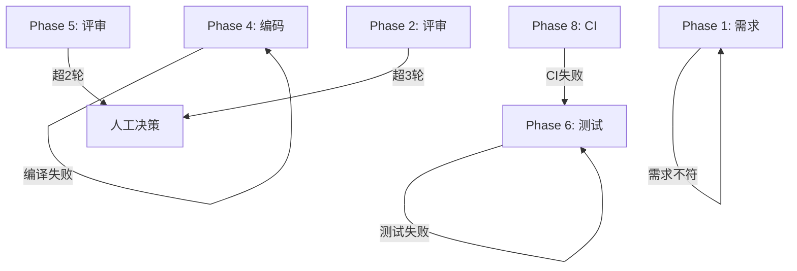

# 开发流程规范

本流程基于 Harness Engineering 十阶段工作流，融合 Define→Plan→Build→Verify→Review→Ship 生命周期。

## 核心原则

1. **流程一致性优先于流程效率** — 默认 Standard-flow，降级必须记录依据
2. **分离实现、审查、测试证据** — 实现、审查、测试由不同 Skill 流程和证据产物承载
3. **进度持久化** — 状态写入文件系统，而非上下文窗口
4. **刚好够用的上下文** — 上下文填充率控制在 40% 以内
5. **唯一 Orchestrator + 本地 Skills** — 不新增独立 Agent 文件

## Harness Iron Laws

1. 未验证，不得声称完成、通过或交付。
2. 未读相关代码、规则或证据，不得提出修改方案或放行结论。
3. Mechanical Gate 失败或阻塞时，不得请求用户人工放行。
4. 任意失败必须 Stop-the-Line 定位根因，不得只修表象或跳过验证。
5. 业务规则未知时必须查 `.harness/wiki/` 或记录疑问，不得猜测。
6. 子代理/隔离上下文只能执行受限任务，不得替代 Orchestrator 决策。
7. 流程分级只能降低阶段密度，不能取消验证、证据、Memory 和用户确认。

## 流程分级

默认使用 Standard-flow。选择 Mini-flow 或 Lite-flow 必须在 `summary.md` 写明降级依据。涉及安全、数据一致性、外部接口、权限、支付、架构边界、迁移、性能瓶颈，或需求不清晰时强制 Standard-flow。

| 流程 | 适用场景 | 阶段形态 | 必需产物 | 门禁要求 | 禁止事项 |
|------|----------|----------|----------|----------|----------|
| Mini-flow | typo、注释、纯文档、无行为变化的小配置 | 理解 → 修改 → 验证 → 记录 | 变更说明、验证证据、Memory check | Mechanical Gate、fresh verification evidence、Memory check、必要用户确认 | 不得声明完整交付流程完成；不得跳过验证 |
| Lite-flow | 单模块/少量文件、低风险行为变化、明确需求的小修复 | 需求确认 → 简化计划 → 实现 → 验证/评审 → 交付 | lite spec、任务清单、验证报告、评审摘要、Memory check | Mechanical Gate、压缩版 Two-stage Review、fresh verification evidence、Memory check、必要用户确认 | 不得用于高风险变更；不得省略评审摘要 |
| Standard-flow | 新功能、跨模块、架构/数据/安全/性能相关变更 | 完整 Phase 1-10 | 全部阶段产物和门禁 | 完整 Mechanical Gate + Human Approval Gate 链路 | 不得跳阶段 |

Mini-flow 可豁免独立评审，但必须记录豁免依据和验证证据。Lite-flow 使用压缩版 Two-stage Review：实现后自检 + 独立/隔离评审摘要。任一流程都不得跳过 verification-before-completion、Memory check、Mechanical Gate。

## 隔离执行上下文原则

隔离执行上下文是 Orchestrator 调度下的受限任务或审查泳道，不是新增 Agent 文件。

- 输入隔离：每个泳道收到同一份不可变输入包。
- 输出隔离：每个泳道只写自己的报告。
- 结论隔离：初次报告产出前不参考其他泳道结论。
- 权限隔离：隔离上下文不能推进 Phase、不能请求用户确认、不能修改无关文件。
- 汇总集中：只有 Orchestrator 能合并报告、判断 Mechanical Gate、请求 Human Approval Gate。

## 十阶段工作流

### Phase 1: 需求分析
- **入口**: 收到需求
- **Skill 加载**: `idea-refine`
- **动作**: 阅读上下文 → 复述需求 → 明确边界 → 输出需求理解文档
- **产出**: `.harness/changes/{id}/request_analysis/understanding.md`
- **Mechanical Gate**: `understanding.md` 存在且包含复述、边界、疑问点
- **Human Approval Gate**: 用户确认需求理解
- **注意**: 此阶段不产 spec.md，只做需求澄清

### Phase 2: 需求评审
- **入口**: Phase 1 门禁通过
- **Skill 加载**: `spec-driven-development`
- **动作**: 基于 understanding.md 编写正式 PRD
- **产出**: `.harness/changes/{id}/request_analysis/spec.md`
- **注意**: 此阶段只产 spec.md，不产 tasks.md。tasks.md 是 Phase 3 的职责
- **评审上限**: 最多 3 轮，超出升级人工
- **Mechanical Gate**: spec.md 存在且 tasks.md 不由 Phase 2 创建
- **Human Approval Gate**: 用户确认 spec

### Phase 3: 任务规划
- **入口**: Phase 2 门禁通过
- **Skill 加载**: `planning-and-task-breakdown`
- **动作**: 分解为可验证任务 → 标注依赖 → 确定优先级
- **产出**: `.harness/changes/{id}/request_analysis/tasks.md`（首次创建）
- **Mechanical Gate**: tasks.md 存在且每个任务有明确验收条件、可独立验证
- **Human Approval Gate**: 用户确认任务规划

### Phase 4: 编码实现
- **入口**: Phase 3 门禁通过
- **Skill 加载**: `incremental-implementation`
- **动作**: Orchestrator 调度本地 Skill 按垂直切片增量实现 → 每片编译验证 → 每片报告进度 → 实现后自检
- **Two-stage Review**: Stage 1: Author/Self Review，由 `auto-check-and-optimize` 在编译后执行
- **验证**: 仅 `mvn clean compile`，不运行测试
- **产出**: `.harness/changes/{id}/coding/coding_report_v1.md`
- **Mechanical Gate**: 编译成功且 coding_report_v1.md 存在，self review completed，fresh verification evidence 已列出
- **Human Approval Gate**: 用户确认可提交评审
- **进度**: 每完成一个子任务报告 "Task i/N 已完成"

### Phase 5: 编码评审
- **入口**: Phase 4 门禁通过
- **Skill 加载**: Orchestrator 并行调度 `code-review-and-quality` + `security-and-hardening` + `performance-optimization`
- **Two-stage Review**: Stage 2: Independent Review，不替代 Phase 4 的 Author/Self Review
- **动作**: 并行执行 3 个本地 Skill 隔离审查泳道，逐一报告完成进度；每个泳道使用同一份不可变输入包，独立写自己的报告，初次结论产出前不参考其他泳道结论，全部完成后才汇总
- **产出**:
  - `.harness/changes/{id}/coding/review/code_review_v1.md`
  - `.harness/changes/{id}/coding/review/security_report_v1.md`
  - `.harness/changes/{id}/coding/review/perf_report_v1.md`
- **评审上限**: 最多 2 轮，超出升级人工
- **Mechanical Gate**: 三份评审报告存在，independent review lanes isolated，review summary exists，Critical=0，Must Fix=0，fresh verification evidence 已列出
- **Human Approval Gate**: 用户确认评审摘要
- **通信**: 汇总后一次展示结论，只问一次用户确认

### Phase 6: 单元测试
- **入口**: Phase 5 门禁通过
- **Skill 加载**: `test-driven-development`
- **动作**: 检查 JaCoCo → 编写单元测试 → 集成测试 → 覆盖率检查
- **产出**: `test_report.md`（含测试总数、通过数、行覆盖率、分支覆盖率）
- **Mechanical Gate**: 测试通过、测试数大于 0、覆盖率 >= 80%
- **Human Approval Gate**: 用户确认测试结果
- **注意**: 此阶段是唯一正式测试阶段。Phase 4 不做测试

### Phase 7: 测试评审
- **入口**: Phase 6 门禁通过
- **Skill 加载**: `code-review-and-quality` 的测试审查标准，按需参考 `test-driven-development`
- **动作**: 审查测试命名、断言质量、边界覆盖、Mock 使用、测试金字塔
- **产出**: `.harness/changes/{id}/unit_test/review/test_review_v1.md`
- **评审上限**: 最多 2 轮
- **Mechanical Gate**: 测试评审报告存在，Must Fix=0
- **Human Approval Gate**: 用户确认测试评审

### Phase 8: CI 验证
- **入口**: Phase 7 门禁通过
- **Skill 加载**: `ci-cd-and-automation`
- **动作**: 运行 `mvn verify` → 检查结果
- **产出**: `.harness/changes/{id}/ci_result/ci_report.md`
- **Mechanical Gate**: CI 报告存在且成功
- **Human Approval Gate**: 用户确认或按规则放行

### Phase 9: 部署验证
- **入口**: Phase 8 门禁通过
- **Skill 加载**: `shipping-and-launch`
- **动作**: 运行 `mvn clean package -DskipTests` → 冒烟测试 → 回滚就绪
- **产出**: `.harness/changes/{id}/deployment/deploy_report.md`
- **Mechanical Gate**: 部署报告存在，冒烟/回滚检查完成
- **Human Approval Gate**: 用户确认部署验证

### Phase 10: 用户确认
- **入口**: Phase 9 门禁通过
- **动作**: 生成 delivery-summary.md → 更新 summary.md → 列出所有归档文件 → 检查 memory 是否需要沉淀
- **Mechanical Gate**: delivery-summary、summary 状态、memory 检查完成
- **Human Approval Gate**: 用户最终确认

## Phase 出口顺序

每个 Phase 必须按以下顺序退出：

1. 检查并记录 Memory：是否有架构决策/错误教训/技术限制？如有，按对应文件模板完整写入。
2. 执行 Mechanical Gate。
3. verification-before-completion：出口报告必须列出 Mechanical Gate 状态、新鲜验证证据（命令、结果、报告路径或审查报告路径）、`Memory recorded: {N} entries / none`。
4. Mechanical Gate 状态为 `fail` 或 `blocked` 时执行 Failure Handling Protocol，不得请求用户人工放行。
5. Mechanical Gate 状态为 `pass` 后，将 Human Approval Gate 标记为 `pending-human`。
6. 用户确认后才能进入下一 Phase。

## 人类确认点

| 确认点 | 时机 | 确认内容 |
|--------|------|---------|
| CK1 | Phase 1 后 | 需求理解确认 |
| CK2 | Phase 2 后 | Spec 评审确认 |
| CK3 | Phase 3 后 | 任务规划确认 |
| CK4 | Phase 4 后 | 编码完成确认 |
| CK5 | Phase 5 后 | 编码评审确认 |
| CK6 | Phase 6 后 | 测试结果确认 |
| CK7 | Phase 7 后 | 测试评审确认 |
| CK8 | Phase 9 前 | 部署参数确认 |
| CK9 | Phase 10 | 最终交付确认 |

## 产物归档结构

```
.harness/changes/{type}-{name}-{YYYYMMDD}/
├── summary.md                       # Phase 1 创建，逐阶段更新
├── request_analysis/
│   ├── understanding.md             # Phase 1
│   ├── spec.md                      # Phase 2
│   ├── tasks.md                     # Phase 3
│   └── review/                      # Phase 2 评审
├── coding/
│   ├── coding_report_v1.md          # Phase 4
│   └── review/
│       ├── code_review_v1.md        # Phase 5
│       ├── security_report_v1.md    # Phase 5
│       └── perf_report_v1.md        # Phase 5
├── unit_test/
│   ├── test_report.md               # Phase 6
│   └── review/
│       └── test_review_v1.md        # Phase 7
├── ci_result/
│   └── ci_report.md                 # Phase 8
└── deployment/
    └── deploy_report.md             # Phase 9
```

## Failure Handling Protocol

任一 Mechanical Gate 状态为 `fail|blocked` 时，必须 Stop-the-Line：

1. 停止进入下一阶段，不请求 Human Approval Gate 放行。
2. 记录失败证据：失败命令、日志、报告路径、缺失条件或阻塞原因。
3. 复现或确认失败条件。
4. 定位根因，区分需求问题、实现问题、测试问题、环境问题或流程问题。
5. 回退到规则定义的 Phase 或当前分级流程对应步骤。
6. 修复并重新验证，生成新的 fresh verification evidence。
7. 如属于 Agent 错误或可复用教训，完整写入 `lessons-learned.md`（问题、根因、影响、修复、预防）。

## 回退路径


